# My Super Studio

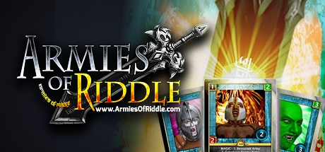


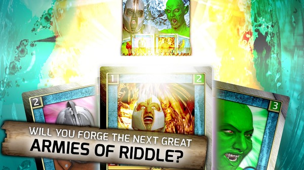
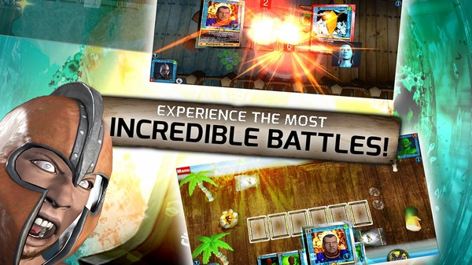
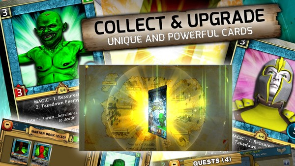
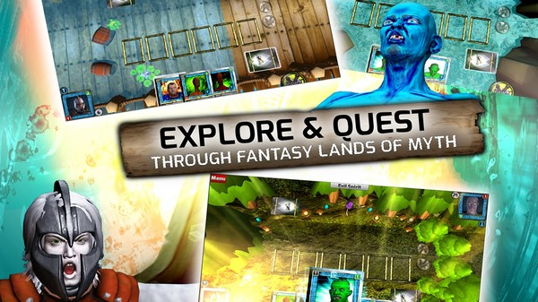
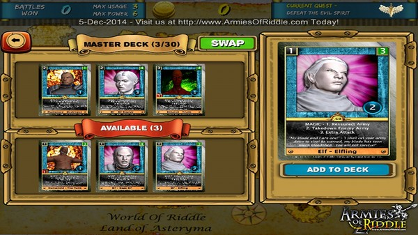


## Armies of Riddle CLASSIC

Armies of Riddle (AoR) CLASSIC is a Battle Card style game for PC. As Seen On: Kickstarter, Canadian Developer Connection and AppClover! Forged in the fires of a distant world, the great crystals of power allow warriors to wield a dangerous army unlike any seen! However not all who wield this power can control it...

### Published by Game Scorpion Inc.

Windows

Genres: Action, Adventure, Casual, Indie, RPG, Strategy

<a target="_blank" href="https://store.steampowered.com/app/527040">See on Steam</a>


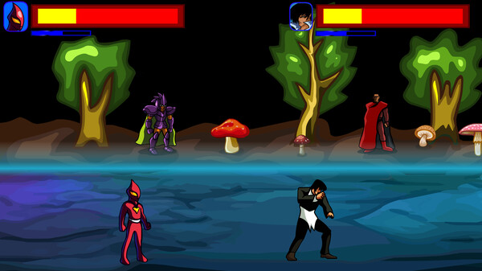
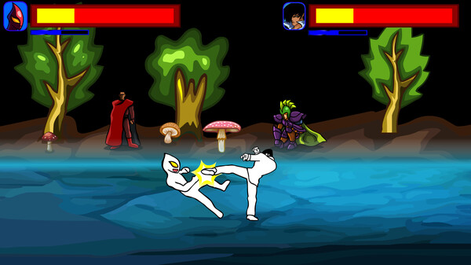
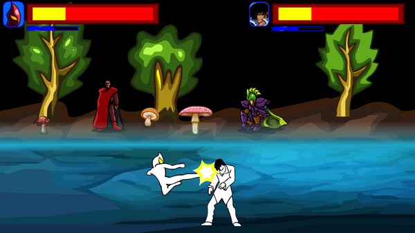
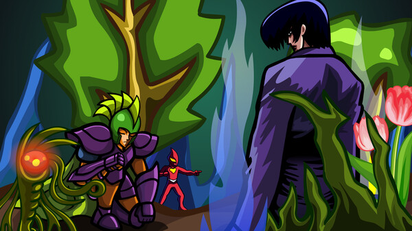
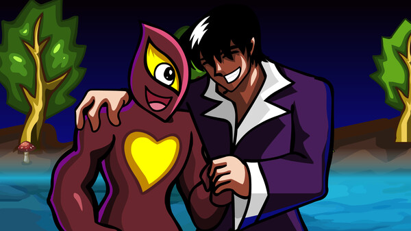


## Black Emperor

This is an independent game with Chinese characteristics and culture! It has a unique way of playing. I hope you can experience unlimited fun and pleasure from it! It's definitely worth it! Otherwise you will regret for life!

### Published by pengjianNiu

Windows

Genres: Action, Casual, Indie

<a target="_blank" href="https://store.steampowered.com/app/2181750">See on Steam</a>
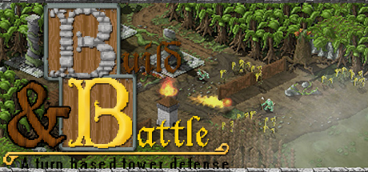


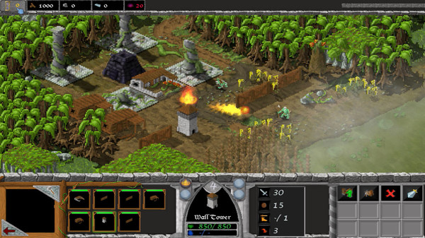
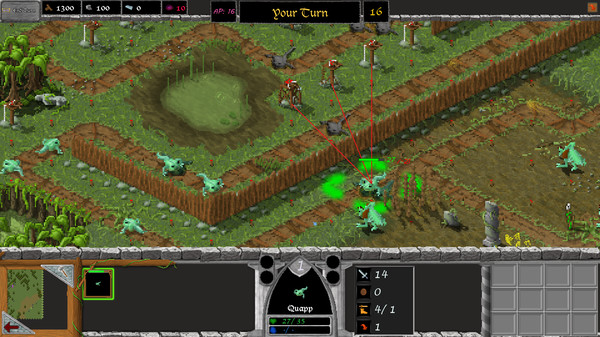
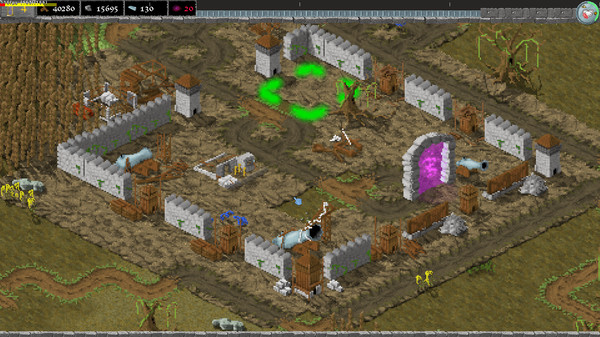
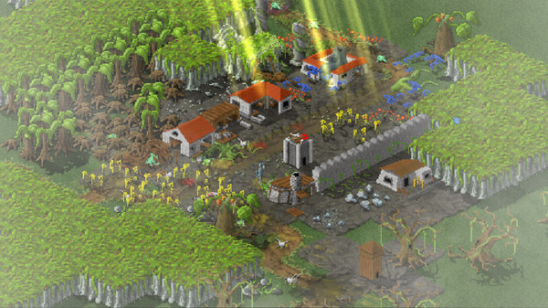
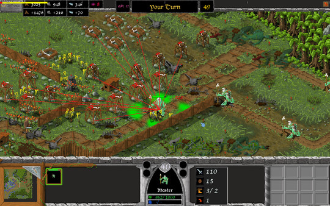
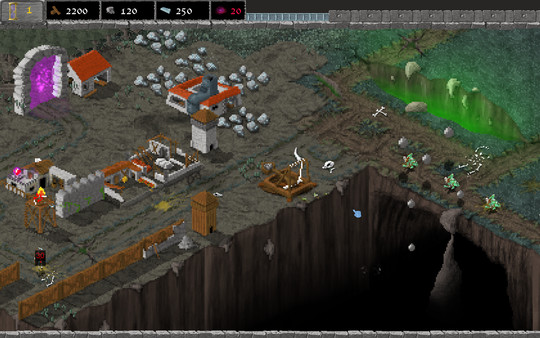
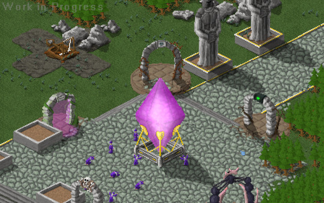
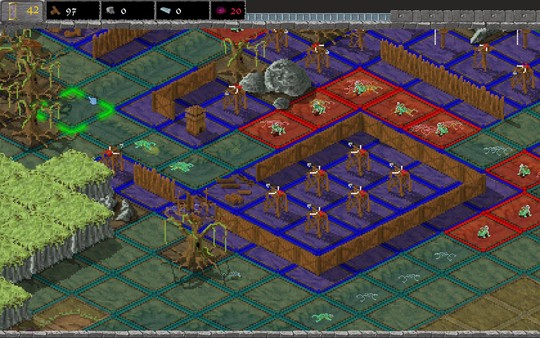


## Build & Battle

Build&amp;Battle is a turn-based tower defense with classic rts base building elements. Build your maze of towers, lay out your plan of attack and execute it with the next turn.

### Published by Funtraum Games

Windows

Genres: Strategy

<a target="_blank" href="https://store.steampowered.com/app/604590">See on Steam</a>
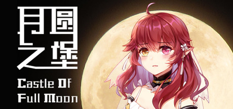


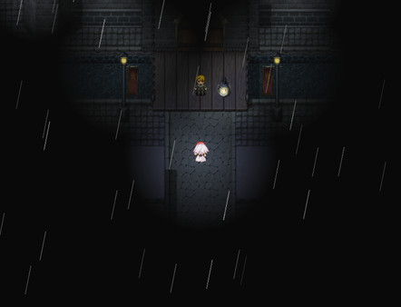
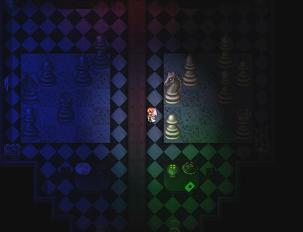
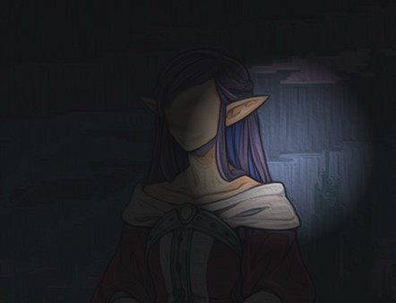
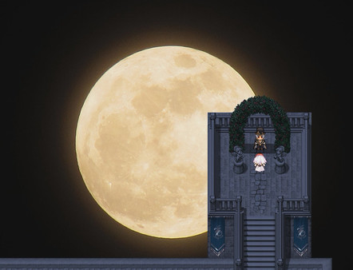
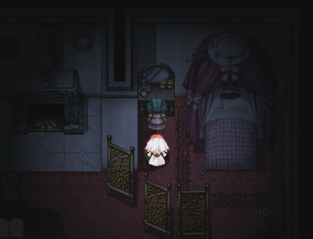
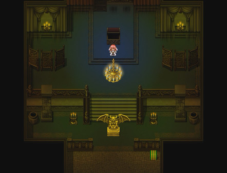
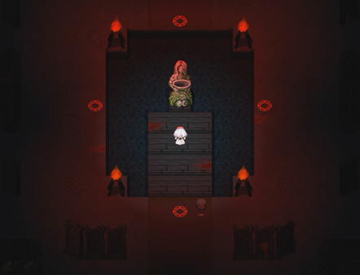
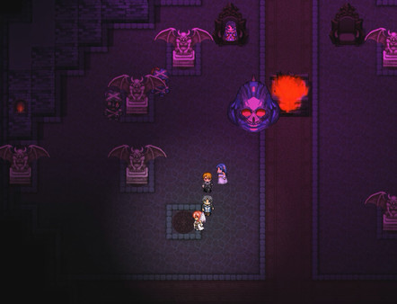
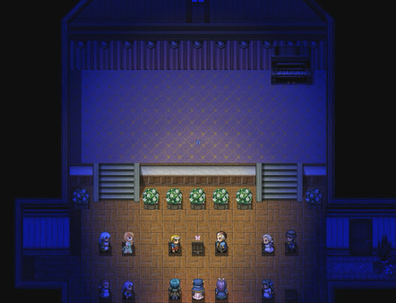
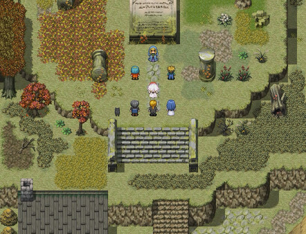


## 月圆之堡 Castle of Full Moon

elf girls marry into a mysterious castle and reveal the horrific truth.

### Published by starknow

Windows

Genres: Indie, RPG

<a target="_blank" href="https://store.steampowered.com/app/1978500">See on Steam</a>
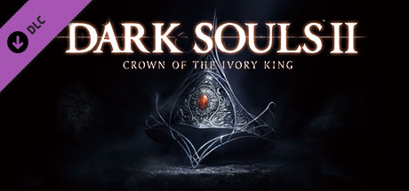


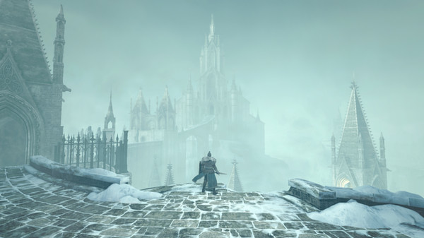
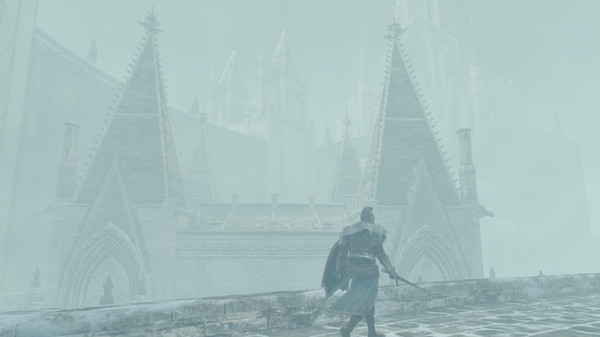
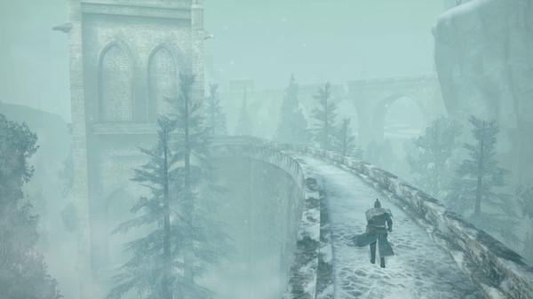
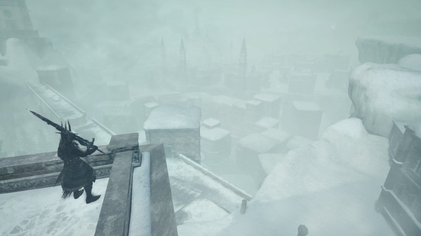
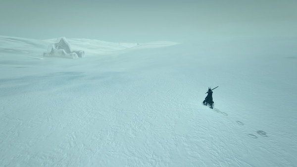
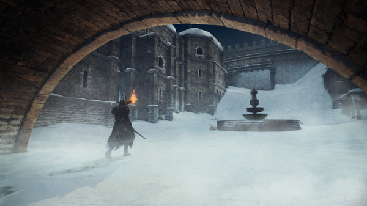
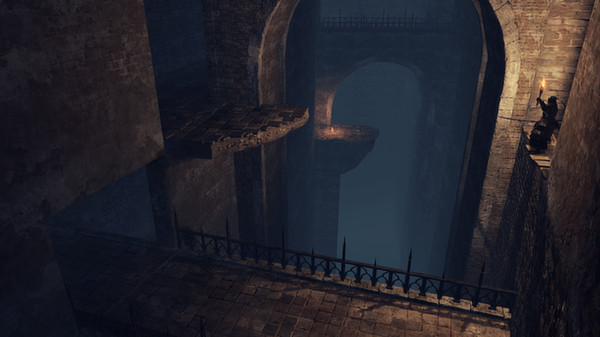
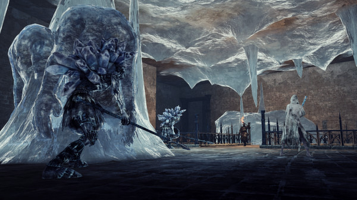
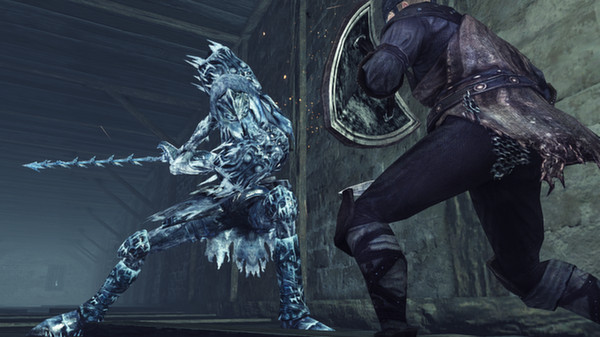
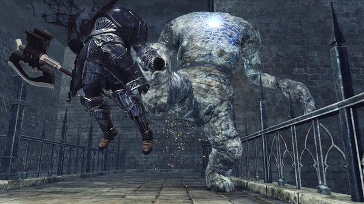
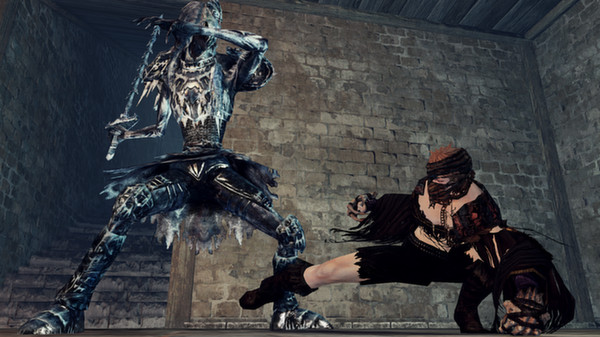
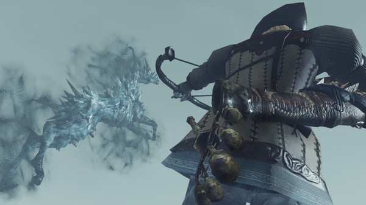
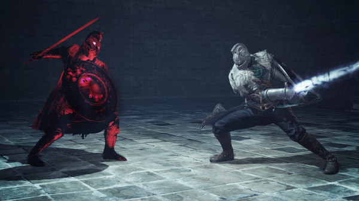
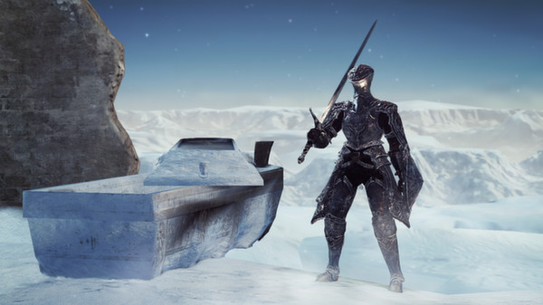
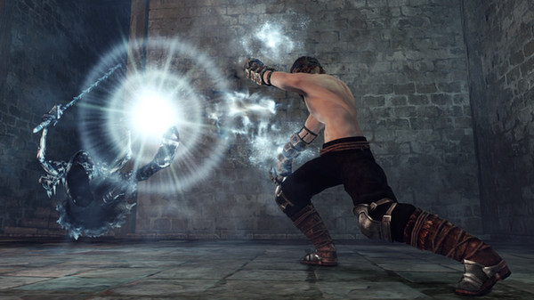
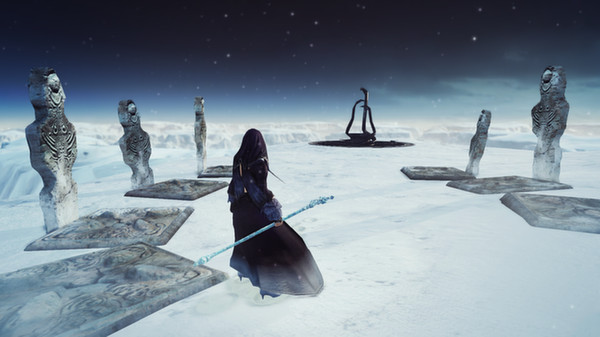
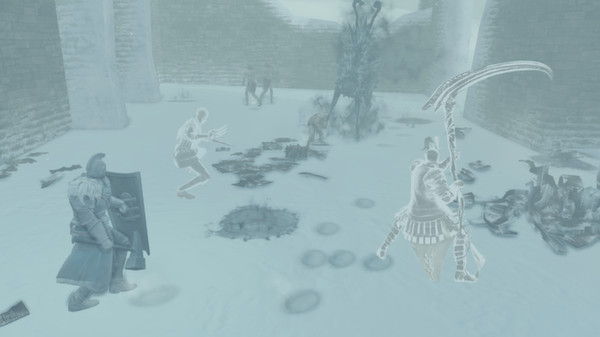
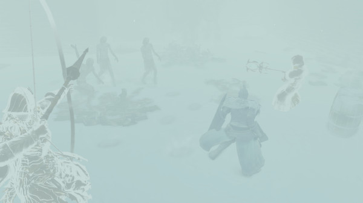


## DARK SOULS™ II Crown of the Ivory King

&quot;DARK SOULS™ II Crown of the Ivory King&quot; is the third of 3 large-scale DLC additions to DARK SOULS™ II, and includes all-new stages, maps, boss characters, weapons &amp; armor! In this third DLC, players will find themselves in a world shining bright with the glow of treacherous ice. Can you find and recover the lost crown?

### Published by BANDAI NAMCO Entertainment

### Published by FromSoftware, Inc

Windows

Genres: Action, RPG

<a target="_blank" href="https://store.steampowered.com/app/271944">See on Steam</a>





## DAEMON X MACHINA - Outer Emotes Set

This set contains the following 10 items for use with DAEMON X MACHINA: Outer Emote - &quot;Pump and Point&quot;, &quot;Roar&quot;, &quot;Fist to Fist&quot;, &quot;Seduce&quot;, &quot;Bravado&quot;, &quot;Sulk&quot;, &quot;Outstretched Arms&quot;, &quot;Slash&quot;, &quot;Breakdance&quot;, &quot;Relax&quot;

### Published by XSEED Games

### Published by Marvelous USA, Inc.

### Published by Marvelous

Windows

Genres: Action

<a target="_blank" href="https://store.steampowered.com/app/1211682">See on Steam</a>