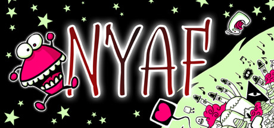
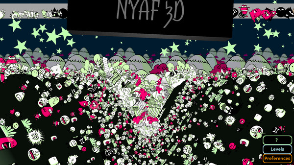
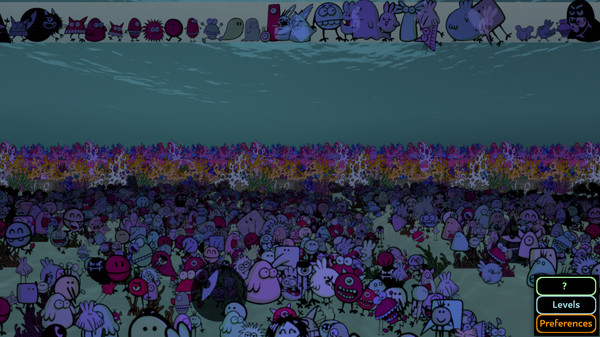
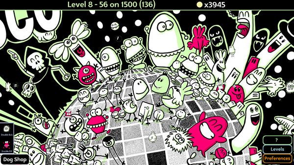
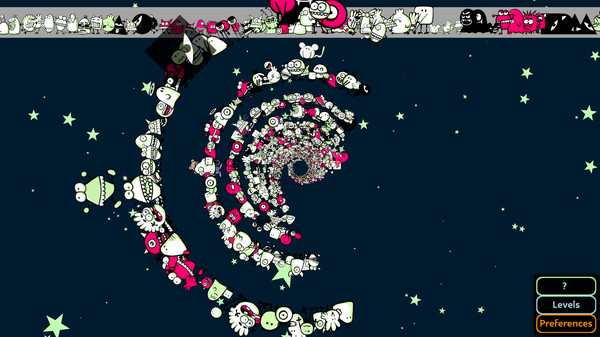
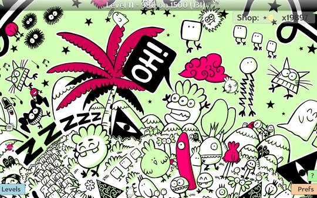
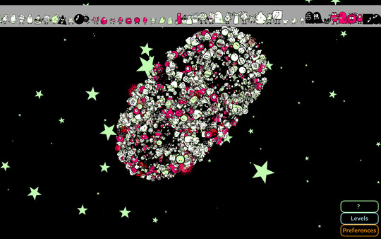

## NYAF





A funky, crazy Hidden Object Game that just feels good. Come have a good time into a warm and unique universe, with great art and music, bonus-games and layers of secrets. Select between 8 levels of difficulties, switch helps on and off, play as you wish!

<a target="_blank" href="http://www.thegiantball.com/2020/04/nyaf.html">Website</a>

#### Published by Alain Becam - TGB

#### Published by The Collective of Video Game Artisans

Windows  , Linux  

Genres: Casual, Indie

<a target="_blank" href="https://store.steampowered.com/app/1378660">See on Steam</a>